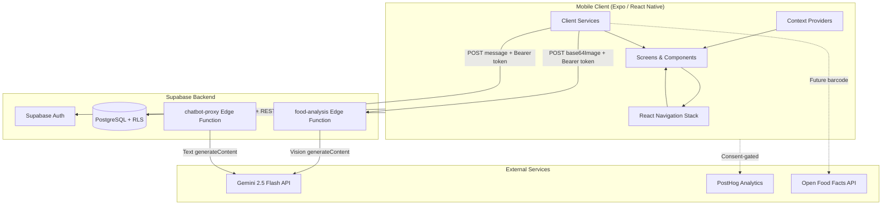
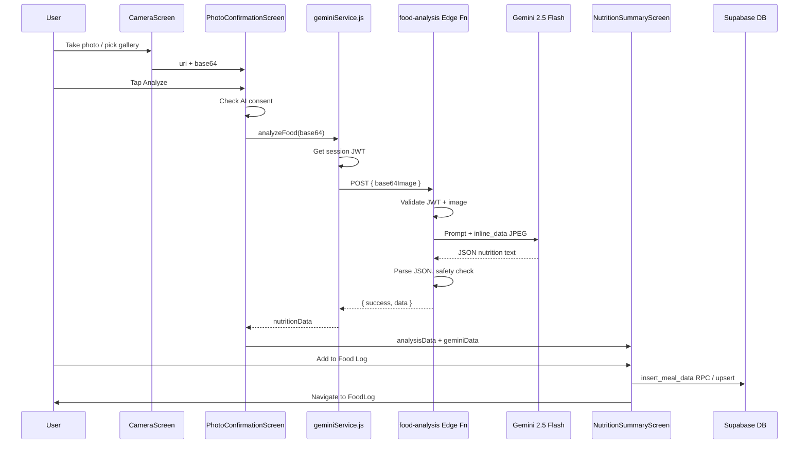
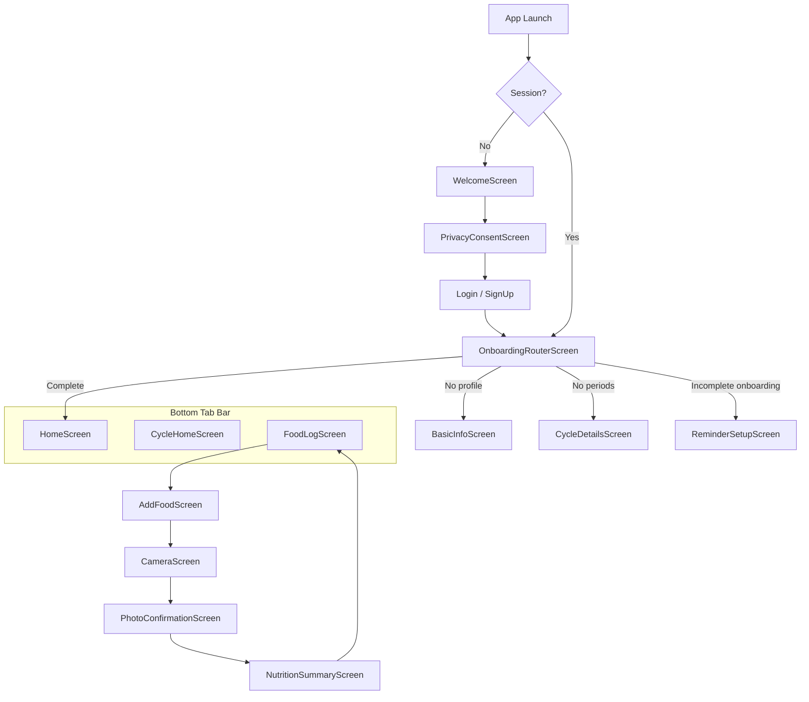

# Aster Health App — Technical Documentation

**Version:** 1.0.0  
**Platform:** Expo 54 / React Native 0.81  
**Backend:** Supabase (PostgreSQL, Auth, Edge Functions)  
**AI Model:** Google Gemini 2.5 Flash (vision + text)  
**Document purpose:** Academic submission, project presentation, and technical review

---

## Table of Contents

1. [Application Overview](#1-application-overview)
2. [Key Features](#2-key-features)
3. [Architecture Diagram](#3-architecture-diagram)
4. [Project Folder Structure](#4-project-folder-structure)
5. [Code Explanation](#5-code-explanation)
6. [AI Model Integration](#6-ai-model-integration)
7. [App Flow Explanation](#7-app-flow-explanation)
8. [How to Run the App Using Expo Go](#8-how-to-run-the-app-using-expo-go)
9. [API / Backend Explanation](#9-api--backend-explanation)
10. [Data Flow](#10-data-flow)
11. [Important Dependencies](#11-important-dependencies)
12. [Error Handling](#12-error-handling)
13. [Security Considerations](#13-security-considerations)
14. [Limitations](#14-limitations)
15. [Future Enhancements](#15-future-enhancements)
16. [Conclusion](#16-conclusion)

---

## 1. Application Overview

### What Is Aster?

**Aster** is a women's health and wellness mobile application built with **Expo / React Native**. It helps users track menstrual cycles, log symptoms, monitor nutrition, and receive AI-assisted health guidance. A flagship capability is **photo-based calorie estimation**: users capture or upload a food image, and the app uses **Gemini 2.5 Flash** (via a secure Supabase Edge Function) to estimate calories, macronutrients, ingredients, and selected micronutrients.

### App Type

| Attribute | Detail |
|-----------|--------|
| Category | Health & wellness / period tracking / nutrition logging |
| Platform | iOS-first mobile app (Android-ready) |
| Architecture | Cross-platform client + cloud backend (Supabase BaaS) |
| Distribution | Expo Go (development), EAS Build (production / TestFlight) |

### Target Users

- People who menstruate and want cycle tracking with predictions
- Users interested in daily nutrition and calorie awareness
- Users who prefer quick food logging via photo instead of manual search
- Users seeking educational wellness support (not clinical diagnosis)

### Problem It Solves

Many health apps split cycle tracking and nutrition into separate products. Aster combines both in one experience and reduces friction in food logging by using **computer vision + generative AI** to estimate nutrition from a meal photo, rather than requiring manual database lookup for every item.

### Main Features

| Feature | Description |
|---------|-------------|
| Authentication | Email/password, Google, Apple, and anonymous sign-in |
| Onboarding | Multi-step profile and cycle setup |
| Cycle tracking | Period logging, predictions, symptom/mood tracking |
| Photo food analysis | Gemini 2.5 Flash vision estimates nutrition from images |
| Manual food logging | Search `test_food` database and enter weight |
| Daily nutrition dashboard | Calorie rings, macro breakdown, water tracking |
| AI chatbot | Gemini-powered wellness assistant (feature-flagged) |
| Analytics | PostHog product analytics (consent-gated) |
| Settings & account | Goals, notifications, privacy, account management |

### How AI Is Used

| AI Use Case | Model | Access Pattern |
|-------------|-------|----------------|
| Food photo analysis | **Gemini 2.5 Flash** (vision) | Client → Supabase Edge Function → Gemini API |
| Wellness chatbot | **Gemini** (text) | Client → `chatbot-proxy` Edge Function → Gemini API |

**Important:** The Gemini API key is **never stored in the mobile app**. All AI calls are proxied through authenticated Supabase Edge Functions.

---

## 2. Key Features

### 2.1 User Onboarding & Authentication

**What it does:** Registers and authenticates users, then routes them through onboarding or directly to the home screen based on profile completeness.

**User interaction:**
1. Welcome screen → Privacy consent → Sign up / Log in
2. Choose email, Google, Apple, or anonymous auth
3. After auth, `OnboardingRouter` sends user to the correct next screen

**Key files:**

| File | Responsibility |
|------|----------------|
| `screens/WelcomeScreen.js` | App entry branding and navigation to consent |
| `screens/PrivacyConsentScreen.js` | Privacy policy acceptance |
| `screens/AuthScreenBase.js` | All auth methods (email, OAuth, anonymous, recovery) |
| `screens/LoginScreen.js` | Wrapper: `AuthScreenBase` with `initialMode="signIn"` |
| `screens/SignUpScreen.js` | Wrapper: `AuthScreenBase` with `initialMode="signUp"` |
| `screens/OnboardingRouterScreen.js` | Post-auth routing logic |
| `lib/supabase.js` | Supabase client, PKCE auth, deep links |
| `utils/authUser.js` | `ensureUserRecord()` upserts into `users` table |

**Data stored:** Supabase Auth session (AsyncStorage), `users`, `user_profiles`, `periods`, `onboarding_answers`, `reminder_settings`

**Important logic:**
- `AuthScreenBase.js` uses PKCE OAuth with redirect URI `https://auth.expo.io/@asterhealth/aster-app` in Expo Go
- On success, `navigation.reset({ routes: [{ name: 'OnboardingRouter' }] })`
- `OnboardingRouterScreen.js` queries `user_profiles` and `periods` to decide: `BasicInfo` → `CycleDetails` → `ReminderSetup` → `Home`

---

### 2.2 Onboarding Flow

**What it does:** Collects demographics, cycle history, flow intensity, health context, and reminder preferences.

**Key files:**

| File | Step |
|------|------|
| `src/context/OnboardingContext.js` | In-memory state across onboarding screens |
| `screens/BasicInfoScreen.js` | Name, birthdate, weight, height |
| `screens/CycleDetailsScreen.js` | Last period date, cycle/period length |
| `screens/FlowIntensityScreen.js` | 6-day flow intensity ratings |
| `screens/OptionalCycleHistoryScreen.js` | Historical period ranges |
| `screens/AdditionalInfoScreen.js` | Health conditions, fertility info |
| `screens/ReminderSetupScreen.js` / `ReminderScreen.js` | Notification preferences; final Supabase persist |

**State management:** React Context via `useOnboarding()` hook with methods: `updateProfile()`, `updateCycle()`, `setFlowIntensity()`, etc.

---

### 2.3 Home Screen

**What it does:** Main dashboard hub after onboarding; entry point for chatbot and quick navigation.

**File:** `screens/HomeScreen.js`

**User interaction:** Bottom tab bar navigation to Cycle, Food, Settings; optional chatbot modal when feature flag enabled.

**Related:** `components/BottomTaskbar.js`, `components/FloatingChatButton.js`, `components/ChatBotModal.js`

---

### 2.4 Cycle Tracking

**What it does:** Visual cycle calendar, period predictions, symptom logging, period check-in.

**File:** `screens/CycleHomeScreen.js` (~1,800 lines — primary cycle hub)

**Supporting files:**

| File | Role |
|------|------|
| `utils/cycleCalculations.js` | Phase calculations (menstrual, follicular, ovulation, luteal) |
| `utils/cyclePredictions.js` | Prediction engine using median cycle lengths |
| `components/CycleWheel.js` | Circular cycle visualization |
| `components/PeriodCheckInSheet.js` | Period confirmation modal |
| `screens/SymptomLogScreen.js` | Symptom/mood/energy logging (transparent modal) |
| `screens/PastAnalyticsScreen.js` | Historical analytics |
| `screens/PastCycleCalendarScreen.js` | Past cycle calendar view |

**Data tables:** `periods`, `cycle_predictions`, `prediction_feedback`, `daily_logs`, `flow_intensity_logs`

---

### 2.5 Food Photo Upload / Camera Capture

**What it does:** Lets users take a photo or pick from gallery; encodes image as base64 for AI analysis.

**File:** `screens/CameraScreen.js`

**User interaction:**
1. Tap camera or gallery button
2. Grant camera permission (native) if needed
3. Capture/edit photo → navigate to confirmation screen

**Technical details:**
- Uses `expo-image-picker` (not a live camera preview — styled placeholder UI)
- Camera: `launchCameraAsync({ allowsEditing: true, quality: 0.85, base64: true })`
- Gallery: `launchImageLibraryAsync({ quality: 0.8, base64: true })`
- Web: hidden `<input type="file">` → `FileReader` → strip data-URL prefix

**Navigation:**
```javascript
navigation.navigate('PhotoConfirmation', {
  image: asset.uri,
  base64: asset.base64,
  selectedDate,
});
```

---

### 2.6 AI-Based Calorie Estimation

**What it does:** Sends base64 JPEG to Gemini 2.5 Flash via Edge Function; returns structured nutrition JSON.

**Flow files:**

| Step | File |
|------|------|
| Preview + trigger | `screens/PhotoConfirmationScreen.js` |
| Client API call | `services/geminiService.js` → `analyzeFood(base64)` |
| Server proxy | `supabase/functions/food-analysis/index.ts` |
| Results display | `screens/NutritionSummaryScreen.js` |

**User interaction:**
1. Review photo on confirmation screen
2. Tap **"Analyze This Photo"**
3. Consent check (`useUserDataSharingConsent`)
4. Loading spinner while AI processes
5. Navigate to nutrition summary

**Consent gate:** AI processing requires user consent via `hooks/useUserDataSharingConsent.js`.

---

### 2.7 Nutrition Breakdown & Meal Logging

**What it does:** Displays AI-estimated calories, macros, ingredients, micronutrients; saves to Supabase.

**File:** `screens/NutritionSummaryScreen.js`

**Displayed data:**
- Food name, description, serving size, weight
- Calories, protein, carbohydrates, fat
- Ingredient list with amounts
- Micronutrients (vitamin D, omega-3, iron)
- `Disclaimer` component with wellness disclaimer

**Save logic (`handleAddToLog`):**
1. Parse numeric values from Gemini strings (e.g. `"12g"` → `12`)
2. Normalize meal type to `Breakfast | Lunch | Dinner | Snack`
3. Call RPC `insert_meal_data` with fallback manual upsert to `meal_logs` + `meals`
4. Track PostHog events: `meal_logged`, `food_logged`
5. Navigate to `FoodLog` with `refreshData: true`

---

### 2.8 Daily Calorie Tracking Dashboard

**What it does:** Shows daily calorie progress ring, macro breakdown, meal slots, water intake, and goals.

**File:** `screens/FoodLogScreen.js`

**Data loading:**
- `fetchUserDailyLogs()` from `utils/meallogger.js`
- `getUserNutritionGoals()` from `utils/nutritionCalculator.js`

**User interaction:**
- "+ Log Food" → meal type picker → `AddFoodScreen`
- Edit calorie/macro/water goals inline
- Pull-to-refresh
- Swipe between tabs via `TabSwipeWrapper`

**Entry to photo flow:** `AddFoodScreen` → "Take a photo instead" → `CameraScreen`

---

### 2.9 Manual Food Entry

**File:** `screens/AddFoodScreen.js`

**What it does:** Search `test_food` table for autocomplete; user enters weight; calculates nutrition proportionally; saves to `meal_logs` / `meals`.

**Alternative path:** "Take a photo instead" links to camera flow.

---

### 2.10 AI Chatbot

**Files:**
- `components/ChatBotModal.js` — UI
- `services/chatbotAPIService_EdgeFunction.js` — API client
- `services/chatbotDataService.js` — Builds health context payload
- `supabase/functions/chatbot-proxy/index.ts` — Server proxy
- `utils/healthGuardrails.js` — Input/output safety validation (chatbot only)

**Feature flag:** `lib/FeatureFlag.js` — `chatbot` flag from env + Supabase `feature_flags` table

---

### 2.11 Settings & Profile

**Files:** `screens/SettingsScreen.js`, `screens/AccountDetailsScreen.js`, `screens/NotificationsScreen.js`, `screens/EditGoalsScreen.js`

**Capabilities:** Account details, nutrition goals, privacy/AI consent, help & feedback, delete meals

---

### 2.12 Analytics & Progress

**Files:** `screens/PastAnalyticsScreen.js`, `screens/PastAnalyticsDetailScreen.js`, `screens/PastCycleCalendarScreen.js`

**Product analytics:** PostHog (`posthog-react-native`) — gated by user data-sharing consent in `App.js`

---

### 2.13 API Integrations Summary

| Service | Purpose | Client File |
|---------|---------|-------------|
| Supabase Auth + DB | Auth, data persistence | `lib/supabase.js` |
| Gemini 2.5 Flash (food) | Photo nutrition analysis | `services/geminiService.js` |
| Gemini (chatbot) | Wellness Q&A | `services/chatbotAPIService_EdgeFunction.js` |
| Open Food Facts | Barcode product lookup (service ready, UI not wired) | `services/openFoodFactsService.js` |
| PostHog | Analytics + session replay | `App.js` |

---

### 2.14 Loading States & Error Handling

| Screen | Loading UI | Error UI |
|--------|------------|----------|
| `PhotoConfirmationScreen` | `ActivityIndicator` + "Analyzing..." | `Alert.alert('Analysis Failed', ...)` |
| `NutritionSummaryScreen` | Save button spinner | `Alert.alert` with DB error message |
| `AuthScreenBase` | Submit/OAuth spinners | Alert with auth error message |
| `OnboardingRouterScreen` | Full-screen spinner | Alert + redirect to Welcome |
| `App.js` | Initial session check spinner | Invalid refresh token → sign out |
| `ConnectivityOverlay` | — | Modal when offline (`@react-native-community/netinfo`) |

---

## 3. Architecture Diagram

### 3.1 High-Level System Architecture



### 3.2 Photo Calorie Estimation Architecture



### 3.3 Navigation Architecture



### 3.4 Architecture Explanation (Plain Language)

1. **Frontend:** A single React Native app organized into screens (UI pages), components (reusable UI), services (API calls), and utilities (calculations, logging).
2. **Navigation:** React Navigation stack navigator; authenticated users navigate via a custom bottom tab bar (`BottomTaskbar.js`).
3. **Backend:** Supabase provides authentication, PostgreSQL database with Row Level Security, and serverless Edge Functions written in Deno/TypeScript.
4. **AI layer:** The mobile app never calls Gemini directly. It sends authenticated requests to Edge Functions, which hold the `GOOGLE_GEMINI_API_KEY` secret and call Gemini 2.5 Flash.
5. **Data:** User meals, cycles, and profiles persist in Supabase tables. Images are **not** uploaded to cloud storage for analysis — only base64 is sent in the API request body for real-time inference.

---

## 4. Project Folder Structure

```
aster-health-app/
├── aster-app/                          # Main Expo application
│   ├── App.js                          # Root: auth, providers, navigation, PostHog
│   ├── index.js                        # App entry point
│   ├── app.config.js                   # Expo config + env → extra
│   ├── eas.json                        # EAS build profiles + env injection
│   ├── package.json                    # Dependencies and npm scripts
│   │
│   ├── screens/                        # Full-screen UI routes (40+ screens)
│   │   ├── WelcomeScreen.js
│   │   ├── AuthScreenBase.js           # Shared auth UI/logic
│   │   ├── LoginScreen.js / SignUpScreen.js
│   │   ├── OnboardingRouterScreen.js
│   │   ├── HomeScreen.js
│   │   ├── CycleHomeScreen.js
│   │   ├── FoodLogScreen.js              # Nutrition dashboard
│   │   ├── AddFoodScreen.js              # Manual food entry
│   │   ├── CameraScreen.js               # Photo capture
│   │   ├── PhotoConfirmationScreen.js    # Preview + AI trigger
│   │   ├── NutritionSummaryScreen.js     # AI results + save
│   │   └── ...
│   │
│   ├── components/                     # Reusable UI
│   │   ├── BottomTaskbar.js            # Main tab navigation
│   │   ├── ChatBotModal.js
│   │   ├── ConnectivityOverlay.js      # Offline modal
│   │   ├── Disclaimer.js               # Wellness disclaimer
│   │   ├── CycleWheel.js
│   │   └── ...
│   │
│   ├── services/                       # External API clients
│   │   ├── geminiService.js            # Food analysis → Edge Function
│   │   ├── chatbotAPIService_EdgeFunction.js
│   │   ├── chatbotDataService.js
│   │   └── openFoodFactsService.js     # Barcode (not wired to UI)
│   │
│   ├── lib/                            # Core integrations
│   │   ├── supabase.js                 # DB client, auth, crypto polyfills
│   │   └── FeatureFlag.js              # Runtime feature toggles
│   │
│   ├── utils/                          # Helpers
│   │   ├── meallogger.js               # Meal DB read/write
│   │   ├── nutritionCalculator.js      # Calorie goal calculation
│   │   ├── healthGuardrails.js         # Chatbot safety
│   │   ├── cycleCalculations.js
│   │   ├── cyclePredictions.js
│   │   ├── authUser.js
│   │   └── CrashLogger.js
│   │
│   ├── hooks/
│   │   └── useUserDataSharingConsent.js  # AI/analytics consent
│   │
│   ├── src/
│   │   ├── context/OnboardingContext.js
│   │   └── workouts/                   # In-development feature
│   │
│   ├── data/
│   │   └── healthInsightSources.js     # Cited health sources
│   │
│   ├── assets/                         # Images, SVG logos
│   ├── ios/ / android/                 # Native project files
│   └── supabase/                       # (referenced at repo root)
│
└── supabase/
    ├── config.toml                     # Local Supabase CLI config
    ├── migrations/                     # SQL schema migrations
    └── functions/
        ├── food-analysis/index.ts      # Gemini 2.5 Flash vision proxy
        └── chatbot-proxy/index.ts      # Gemini text chatbot proxy
```

### Folder Connection Map

| Folder | Connects To | Why Needed |
|--------|-------------|------------|
| `screens/` | `components/`, `services/`, `lib/supabase.js` | Each screen composes UI and calls services |
| `services/` | Supabase Edge Functions | Encapsulates HTTP calls with auth headers |
| `lib/` | Supabase cloud | Shared client used app-wide |
| `utils/` | Screens + services | Pure logic (nutrition math, logging, predictions) |
| `supabase/functions/` | Gemini API | Server-side secrets and validation |
| `supabase/migrations/` | PostgreSQL | Schema, RLS policies, RPC functions |

---

## 5. Code Explanation

### 5.1 `App.js` — Application Root

**Path:** `aster-app/App.js`

**Purpose:** Bootstraps the app, manages auth session state, wraps providers, and defines the navigation stack.

**Key elements:**
- **State:** `session`, `loading`, `posthogClient`
- **Providers (outer → inner):** `UserDataSharingConsentProvider` → `OnboardingProvider` → `FeatureFlagsProvider` → `NavigationContainer`
- **Auth effect:** `supabase.auth.getSession()` + `onAuthStateChange`
- **Conditional stacks:** Unauthenticated users see Welcome/Login; authenticated users see Home/Cycle/Food routes
- **PostHog:** Initialized only when analytics consent is granted

**Connection:** Every screen is registered here. Session state determines which stack renders.

---

### 5.2 `lib/supabase.js` — Database & Auth Client

**Path:** `aster-app/lib/supabase.js`

**Purpose:** Creates the Supabase client with React Native compatibility.

**Key logic:**
- **Env vars:** `EXPO_PUBLIC_SUPABASE_URL`, `EXPO_PUBLIC_SUPABASE_ANON_KEY` (fallback via `Constants.expoConfig.extra`)
- **Crypto polyfills:** SHA-256 digest + `getRandomValues` for PKCE auth on React Native
- **Fetch timeout:** 15-second abort wrapper prevents infinite hangs
- **Auth config:** AsyncStorage persistence, PKCE flow, auto token refresh
- **Deep links:** Listens for `aster://auth/callback` OAuth returns

---

### 5.3 `screens/CameraScreen.js` — Image Capture

**Purpose:** Capture or select food photos with base64 encoding.

**Main functions:**

| Function | Behavior |
|----------|----------|
| `ensureCameraPermission()` | Requests/checks camera permission; prompts Settings if denied |
| `takePhoto()` | `ImagePicker.launchCameraAsync` with `base64: true` |
| `pickFromGallery()` | `launchImageLibraryAsync` with `base64: true` |
| `handleManualEntry()` | Bypasses AI → navigates to `AddFoodScreen` |

**Props/route params:** `mealType`, `selectedDate`

---

### 5.4 `screens/PhotoConfirmationScreen.js` — AI Trigger

**Purpose:** Shows photo preview; initiates Gemini analysis.

**Main function:** `handleAnalyzePhoto()`

```javascript
// Simplified flow
const consentGranted = await requestConsent();
const nutritionData = await analyzeFood(base64);
const analysisData = { /* mapped from Gemini JSON */ };
navigation.navigate('NutritionSummary', { photoUri, analysisData, geminiData });
```

**State:** `analyzing` — controls loading spinner on analyze button.

---

### 5.5 `services/geminiService.js` — Client AI Service

**Purpose:** Authenticated proxy call to the food-analysis Edge Function.

**Main export:** `analyzeFood(base64Image)`

**Steps:**
1. Check AI data-sharing consent
2. Validate base64 string
3. Get Supabase session JWT
4. `POST` to `EXPO_PUBLIC_FOOD_ANALYSIS_URL` (or default Supabase URL)
5. Handle `result.blocked` (safety filter) and `result.success`
6. Return `result.data` (parsed nutrition JSON)

**Security:** No Gemini API key in this file — only Supabase anon key + user JWT.

---

### 5.6 `supabase/functions/food-analysis/index.ts` — Server AI Proxy

**Purpose:** Secure server-side Gemini 2.5 Flash vision call.

**Main handler steps:**
1. Authenticate user via `Authorization` header
2. Validate base64 image (format + 10MB max)
3. Read `GOOGLE_GEMINI_API_KEY` from Edge Function secrets
4. Call `gemini-2.5-flash:generateContent` with text prompt + `inline_data` JPEG
5. Parse JSON from model response (handles markdown code fences)
6. Return `{ success: true, data: nutritionData, metadata }`

**Model endpoint:**
```
https://generativelanguage.googleapis.com/v1beta/models/gemini-2.5-flash:generateContent
```

---

### 5.7 `screens/NutritionSummaryScreen.js` — Results & Persistence

**Purpose:** Display AI nutrition breakdown; save meal to database.

**Route params:** `photoUri`, `analysisData`, `geminiData`

**Main function:** `handleAddToLog()`
- Parses macro strings (`"12g"` → `12`)
- Normalizes meal type
- Ensures `users` row exists
- Saves via `insert_meal_data` RPC with manual fallback
- Captures PostHog analytics
- Navigates to `FoodLog` with refresh flag

**UI components used:** `Disclaimer`, `InfoIcon`, `SourcesModal`

---

### 5.8 `screens/FoodLogScreen.js` — Nutrition Dashboard

**Purpose:** Daily calorie tracking hub with progress rings and meal breakdown.

**Key imports:** `fetchUserDailyLogs`, `getUserNutritionGoals`, `BottomTaskbar`

**Hooks:** `useFocusEffect` reloads data when screen gains focus (e.g. after saving a meal)

---

### 5.9 `utils/meallogger.js` — Meal Data Access

**Purpose:** Database helpers for meal logging.

| Export | Purpose |
|--------|---------|
| `upsertMealLog()` | Upsert daily log + meal slot |
| `fetchUserDailyLogs()` | RPC `get_user_daily_logs` with fallback |
| `upsertWaterLog()` | Water intake tracking |

**Note:** Photo save path in `NutritionSummaryScreen` uses RPC directly; `meallogger` is used by `FoodLogScreen` for reads.

---

### 5.10 `utils/nutritionCalculator.js` — Goal Calculation

**Purpose:** Computes calorie/macro targets using Harris-Benedict BMR → TDEE → 40/30/30 macro split.

**Main exports:** `calculateNutritionGoals()`, `getUserNutritionGoals()`

**Data source:** `nutrition_goals` table, fallback to `user_profiles` demographics.

---

### 5.11 `screens/AuthScreenBase.js` — Authentication Hub

**Purpose:** Unified auth UI for sign-in, sign-up, OAuth, anonymous, and password recovery.

**Main functions:**

| Function | Auth Method |
|----------|-------------|
| `handleSubmitEmail()` | Email/password sign-in or sign-up |
| `handleOAuthSignIn()` | Google / Apple via `WebBrowser.openAuthSessionAsync` |
| `handleAnonymousSubmit()` | `supabase.auth.signInAnonymously()` |
| `handleSendRecoveryOtp()` | Password reset OTP |

**Timeout:** 20-second auth timeout wrapper prevents infinite loading spinners.

---

## 6. AI Model Integration

### 6.1 Model Used

**Gemini 2.5 Flash** — Google's multimodal model supporting text + image input, used for food photo analysis.

Configured in: `supabase/functions/food-analysis/index.ts` (line 95)

### 6.2 Image Capture & Transmission

| Step | Implementation |
|------|----------------|
| Capture | `expo-image-picker` with `base64: true` |
| Format | JPEG, base64-encoded string |
| Storage | Local URI for UI display only; **not** uploaded to Supabase Storage |
| Transmission | HTTP POST JSON body: `{ "base64Image": "<base64 string>" }` |
| MIME type sent to Gemini | `image/jpeg` as `inline_data` |

### 6.3 Prompt Sent to Gemini 2.5 Flash

The Edge Function sends this prompt (abbreviated — full prompt in `food-analysis/index.ts`):

```
Analyze this food image and return ONLY a JSON object with the following structure.
Do not include any other text or explanations:

{
  "food_name": "Name of the food item",
  "description": "Brief description of the food",
  "calories": 0,
  "protein": "0g",
  "carbohydrates": "0g",
  "fat": "0g",
  "serving_info": {
    "type": "Dinner/Lunch/Breakfast/Snack",
    "servings": "1 serving",
    "weight": "0g"
  },
  "ingredients": [
    {"name": "Ingredient 1", "amount": "0g"}
  ],
  "micronutrients": {
    "vitamin_d": "0.00 mg",
    "omega_3": "0.00 mg",
    "iron": "0.00 mg"
  }
}

Provide realistic nutritional estimates based on typical serving sizes for the food shown.
```

**Generation config:** `temperature: 0.7`, `topK: 40`, `topP: 0.95`, `maxOutputTokens: 2048`

**Safety settings:** All harm categories set to `BLOCK_MEDIUM_AND_ABOVE`

### 6.4 Expected Model Response

```json
{
  "food_name": "Grilled Chicken Salad",
  "description": "Mixed greens with grilled chicken breast and vegetables",
  "calories": 420,
  "protein": "35g",
  "carbohydrates": "18g",
  "fat": "22g",
  "serving_info": {
    "type": "Lunch",
    "servings": "1 serving",
    "weight": "350g"
  },
  "ingredients": [
    { "name": "Grilled chicken breast", "amount": "150g" },
    { "name": "Mixed greens", "amount": "100g" }
  ],
  "micronutrients": {
    "vitamin_d": "0.50 mg",
    "omega_3": "0.20 mg",
    "iron": "2.10 mg"
  }
}
```

### 6.5 Response Processing

1. Edge Function extracts JSON (strips `` ```json `` markdown if present)
2. `PhotoConfirmationScreen` maps Gemini fields → `analysisData` for UI
3. `NutritionSummaryScreen` parses numeric values for database storage

### 6.6 User-Facing Display

`NutritionSummaryScreen` renders:
- Hero photo
- Food name and description
- Calorie count with progress toward daily goal
- Macro cards (protein, carbs, fat)
- Expandable ingredients list
- Micronutrient rows
- Wellness disclaimer (`components/Disclaimer.js`)

### 6.7 AI Limitations & Disclaimers

**Disclaimer text** (`components/Disclaimer.js`):
> *"Aster is intended for general wellness and educational purposes only. It is not a medical device and does not provide medical diagnosis, advice, or treatment. Always consult a qualified healthcare professional before making medical decisions."*

**AI-specific limitations:**
- Estimates are based on visual inference, not laboratory measurement
- Portion sizes may be inaccurate from a single photo angle
- Hidden ingredients (oils, sauces) may not be detected
- Results should be confirmed/edited by the user before logging
- Blocked images return: *"Image content blocked by safety filters"*

---

## 7. App Flow Explanation

### 7.1 Complete User Journey — Photo Calorie Estimation

| Step | User Action | Frontend | Backend / AI |
|------|-------------|----------|--------------|
| 1 | Opens app | `App.js` checks Supabase session | `getSession()` |
| 2 | Logs in | `AuthScreenBase` → `OnboardingRouter` | Supabase Auth |
| 3 | Lands on Food tab | `FoodLogScreen` loads daily logs | `get_user_daily_logs` RPC |
| 4 | Taps "+ Log Food" | Meal type picker modal | — |
| 5 | Selects meal type | Navigates to `AddFoodScreen` | — |
| 6 | Taps "Take a photo instead" | Navigates to `CameraScreen` | — |
| 7 | Takes photo | `ImagePicker` returns uri + base64 | — |
| 8 | Reviews photo | `PhotoConfirmationScreen` displays preview | — |
| 9 | Taps "Analyze" | Consent check → `analyzeFood()` | — |
| 10 | Waits (spinner) | `geminiService.js` POSTs to Edge Function | JWT validation |
| 11 | — | — | Edge Function calls **Gemini 2.5 Flash** |
| 12 | Sees nutrition results | `NutritionSummaryScreen` renders data | — |
| 13 | Taps "Add to Food Log" | `handleAddToLog()` | `insert_meal_data` RPC |
| 14 | Returns to dashboard | `FoodLogScreen` refreshes totals | Reads `meal_logs`, `meals` |

### 7.2 Authentication Journey

```
Welcome → PrivacyConsent → SignUp/Login → OnboardingRouter
  → (if new) BasicInfo → CycleDetails → ... → Home
  → (if returning) Home
```

### 7.3 First-Time Onboarding Journey

```
BasicInfo → CycleDetails → FlowIntensity → OptionalCycleHistory
  → AdditionalInfo → ReminderSetup → Reminder → Home
```

On completion, `ReminderScreen.js` writes all onboarding data to Supabase and sets `onboarding_completed: true`.

---

## 8. How to Run the App Using Expo Go

### 8.1 Prerequisites

| Requirement | Version / Notes |
|-------------|-----------------|
| Node.js | v18+ recommended |
| npm | Comes with Node.js |
| Expo Go app | Install on iOS/Android physical device |
| Git | To clone repository |
| Supabase project | Must be active (not paused) |
| Gemini API key | **Not needed locally** — configured as Edge Function secret |

Optional:
- Xcode + iOS Simulator (Mac only)
- Android Studio + emulator
- EAS CLI for production builds

### 8.2 Installation

```bash
git clone <repository-url>
cd aster-health-app/aster-app
npm install
```

### 8.3 Environment Variables

Create `aster-app/.env`:

```env
EXPO_PUBLIC_SUPABASE_URL=https://your-project.supabase.co
EXPO_PUBLIC_SUPABASE_ANON_KEY=your_supabase_anon_key
EXPO_PUBLIC_FOOD_ANALYSIS_URL=https://your-project.supabase.co/functions/v1/food-analysis
EXPO_PUBLIC_SUPABASE_EDGE_FUNCTION_URL=https://your-project.supabase.co/functions/v1/chatbot-proxy
EXPO_PUBLIC_ENABLE_CHATBOT=true
```

> **Note:** Do **not** put `GOOGLE_GEMINI_API_KEY` in `.env`. Configure it as a Supabase Edge Function secret:
> ```bash
> supabase secrets set GOOGLE_GEMINI_API_KEY=your_key_here
> ```

The `.env` file is gitignored. Values are also injected in `eas.json` for EAS builds.

### 8.4 Running the App

```bash
cd aster-app
npx expo start --go --clear
```

| Target | Command / Action |
|--------|------------------|
| **Expo Go (physical device)** | Scan QR code; same Wi-Fi as dev machine |
| **Expo Go (remote network)** | `npx expo start --go --tunnel` |
| **iOS Simulator** | Press `i` or `npx expo start --ios` |
| **Android Emulator** | Press `a` or `npx expo start --android` |
| **Web** | Press `w` or `npm run web` |

### 8.5 Development Build (Full Native Features)

For features not available in Expo Go (push notifications, dev client):

```bash
npm run start:ios    # Terminal 1: Metro
npm run ios-sim      # Terminal 2: Simulator
```

### 8.6 Troubleshooting

| Issue | Solution |
|-------|----------|
| Missing Supabase env vars | Create `.env`, restart with `--clear` |
| Login spins forever | Check Supabase project is active; verify network |
| Metro cache issues | `npx expo start --clear` |
| Expo Go won't connect | Use `--tunnel` mode |
| AI analysis fails | Ensure logged in + AI consent enabled in Settings |
| Dependency conflicts | `npm install --legacy-peer-deps` |
| OAuth fails in Expo Go | Add `https://auth.expo.io/@asterhealth/aster-app` to Supabase redirect URLs |

---

## 9. API / Backend Explanation

### 9.1 Backend Technology

| Layer | Technology |
|-------|------------|
| Database | PostgreSQL (Supabase) |
| Auth | Supabase Auth (PKCE, OAuth, anonymous) |
| API | Supabase REST + RPC + Edge Functions (Deno) |
| AI | Google Gemini 2.5 Flash via Edge Functions |
| Security | Row Level Security (RLS) on all user tables |

### 9.2 Edge Function: `food-analysis`

**Endpoint:** `POST /functions/v1/food-analysis`

**Request:**
```http
POST /functions/v1/food-analysis
Authorization: Bearer <supabase_jwt>
apikey: <supabase_anon_key>
Content-Type: application/json

{
  "base64Image": "<base64-encoded-jpeg>"
}
```

**Success response (200):**
```json
{
  "success": true,
  "data": {
    "food_name": "...",
    "calories": 420,
    "protein": "35g",
    "carbohydrates": "18g",
    "fat": "22g",
    "serving_info": { "type": "Lunch", "servings": "1 serving", "weight": "350g" },
    "ingredients": [{ "name": "...", "amount": "..." }],
    "micronutrients": { "vitamin_d": "...", "omega_3": "...", "iron": "..." }
  },
  "metadata": {
    "model": "gemini-2.5-flash",
    "timestamp": "2026-06-06T22:00:00.000Z",
    "user_id": "uuid"
  }
}
```

**Error responses:**
- `401` — Missing/invalid JWT
- `400` — Invalid base64 or image too large
- `200` with `blocked: true` — Gemini safety filter triggered
- `500` — Gemini API or server error

### 9.3 Edge Function: `chatbot-proxy`

**Endpoint:** `POST /functions/v1/chatbot-proxy`

Proxies text chat to Gemini with server-side guardrails, PII sanitization, and audit logging to `chatbot_audit_logs`.

### 9.4 Database RPC Functions

| RPC | Used By | Purpose |
|-----|---------|---------|
| `insert_meal_data` | `NutritionSummaryScreen` | Atomic meal insert with daily totals |
| `get_user_daily_logs` | `FoodLogScreen`, `meallogger.js` | Fetch daily nutrition + water |
| `delete_my_account` | Account deletion | GDPR-style account removal |

### 9.5 Key Database Tables

| Table | Purpose |
|-------|---------|
| `users` | Core user record (cycle prefs) |
| `user_profiles` | Demographics, onboarding state |
| `periods` | Period start/end logs |
| `meal_logs` | Daily calorie/macro totals |
| `meals` | Per-meal-type breakdown (Breakfast/Lunch/Dinner/Snack) |
| `nutrition_goals` | User calorie/macro/water targets |
| `water_logs` | Daily water intake |
| `test_food` | Manual food search database |
| `feature_flags` | Runtime feature toggles |
| `ai_disclaimer_consents` | AI disclaimer acceptance records |

### 9.6 Authentication Flow

1. Client calls `supabase.auth.signInWithPassword()` or OAuth
2. Supabase returns JWT access + refresh tokens
3. Tokens stored in AsyncStorage
4. All DB/API calls include `Authorization: Bearer <jwt>`
5. RLS policies enforce `auth.uid() = user_id` on user data

### 9.7 Client vs Server Gemini Access

**The app does NOT call Gemini directly from the mobile client.**

| Approach | Status |
|----------|--------|
| Client-side Gemini SDK with API key | ❌ Not used (security risk) |
| Supabase Edge Function proxy | ✅ Implemented |

This prevents API key extraction from the app bundle.

---

## 10. Data Flow

### 10.1 Photo → Calorie Result Data Flow

```mermaid
flowchart LR
    A[User Photo] --> B[base64 string]
    B --> C[geminiService.analyzeFood]
    C --> D[Edge Function]
    D --> E[Gemini 2.5 Flash]
    E --> F[JSON nutrition object]
    F --> G[PhotoConfirmationScreen mapping]
    G --> H[NutritionSummaryScreen UI]
    H --> I[User confirms]
    I --> J[insert_meal_data RPC]
    J --> K[(meal_logs + meals)]
    K --> L[FoodLogScreen dashboard]
```



### 10.2 Data Flow Table

| Stage | Data Format | Location |
|-------|-------------|----------|
| User input | JPEG image | Device camera/gallery |
| Encoding | Base64 string | In-memory (route params) |
| API request | `{ base64Image }` JSON | HTTPS to Edge Function |
| AI processing | Prompt + inline JPEG | Gemini API |
| AI response | Nutrition JSON | Edge Function → client |
| UI rendering | `analysisData` object | `NutritionSummaryScreen` |
| Persistence | Numeric calories/macros | Supabase `meal_logs`, `meals` |
| Dashboard read | Aggregated daily totals | `FoodLogScreen` via RPC |

### 10.3 Session & Auth Data Flow

```
Login → Supabase Auth → JWT → AsyncStorage
JWT → All Supabase queries (RLS-filtered)
JWT → Edge Function Authorization header
```

---

## 11. Important Dependencies

| Package | Version | Purpose |
|---------|---------|---------|
| `expo` | ~54.0.33 | React Native framework, tooling, native modules |
| `react` | 19.1.0 | UI rendering |
| `react-native` | 0.81.5 | Mobile runtime |
| `@react-navigation/native` | ^7.1 | Screen navigation |
| `@react-navigation/stack` | ^7.4 | Stack navigator |
| `@supabase/supabase-js` | ^2.51 | Auth + database client |
| `@react-native-async-storage/async-storage` | 2.2.0 | Session persistence |
| `expo-image-picker` | ~17.0 | Camera/gallery photo capture |
| `expo-auth-session` | ~7.0 | OAuth redirect handling |
| `expo-web-browser` | ~15.0 | OAuth browser sessions |
| `expo-crypto` | ~15.0 | PKCE crypto for auth |
| `posthog-react-native` | ^4.14 | Product analytics |
| `react-native-svg` | 15.12 | Progress rings, charts |
| `react-native-gesture-handler` | ~2.28 | Swipe navigation |
| `react-native-safe-area-context` | ~5.6 | Safe area insets |
| `@react-native-community/netinfo` | 11.4 | Offline detection |
| `date-fns` | ^4.1 | Date formatting/calculations |
| `expo-linear-gradient` | ~15.0 | Gradient UI backgrounds |
| `expo-blur` | ~15.0 | Blur effects on FoodLog |
| `expo-notifications` | ~0.32 | Reminder notifications |
| `jest` / `jest-expo` | ^29 / ~54 | Unit testing |

**Notable:** No client-side Gemini SDK — AI calls go through Supabase Edge Functions via standard `fetch`.

---

## 12. Error Handling

### 12.1 Photo & AI Errors

| Scenario | Handler | User Message |
|----------|---------|--------------|
| No base64 data | `PhotoConfirmationScreen` | "Image data not available for analysis" |
| AI consent denied | `requestConsent()` | "AI analysis is currently off..." |
| Not authenticated | `geminiService.js` | "Please log in to use food analysis" |
| Safety filter block | Edge Function `finishReason === 'SAFETY'` | "Unable to analyze this image..." |
| Invalid AI JSON | Edge Function parse error | "Failed to analyze food. Please try again." |
| Network timeout | 15s fetch timeout in `supabase.js` | "Could not reach the server..." |
| Image too large | Edge Function validation | "Image too large (max 10MB)" |

### 12.2 Camera Errors

| Scenario | Handler |
|----------|---------|
| Permission denied | Alert → "Open Settings" via `Linking.openSettings()` |
| Camera launch failure | Alert: "Failed to take photo" |
| Web unsupported | File input fallback |

### 12.3 Auth Errors

| Scenario | Handler |
|----------|---------|
| Invalid credentials | Alert: "Invalid password" |
| Auth timeout (20s) | Alert: connection/server message |
| OAuth cancelled | Silent (no alert) |
| OAuth timeout | Attempts session recovery, then error alert |

### 12.4 Database Errors

| Scenario | Handler |
|----------|---------|
| RPC failure | Fallback manual upsert in `NutritionSummaryScreen` |
| Upsert failure | Alert with specific DB error message |
| No user session | Alert: "Please log in to save food data" |

### 12.5 App-Level Errors

| Component | Handler |
|-----------|---------|
| `ConnectivityOverlay` | Full-screen modal when offline |
| `CrashLogger.js` | Global JS error handler + leveled logging |
| `App.js` | Invalid refresh token → automatic sign-out |

---

## 13. Security Considerations

### 13.1 API Key Protection

| Secret | Storage Location |
|--------|------------------|
| `GOOGLE_GEMINI_API_KEY` | Supabase Edge Function secrets only |
| `EXPO_PUBLIC_SUPABASE_ANON_KEY` | Client `.env` (designed to be public; protected by RLS) |
| Supabase service role key | Never in client code |

### 13.2 Why Gemini Keys Must Not Be in the Frontend

Any key embedded in a mobile app bundle can be extracted via reverse engineering. The **Edge Function proxy pattern** ensures:
- API key stays server-side
- Requests require valid user JWT
- Rate limiting and validation happen server-side

### 13.3 User Data Privacy

| Measure | Implementation |
|---------|----------------|
| Row Level Security | All user tables enforce `auth.uid()` policies |
| AI consent | Required before photo analysis or analytics |
| Image handling | Photos sent for inference only; not stored in cloud by default |
| PII in chatbot | Server-side sanitization in `chatbot-proxy` |
| Analytics | PostHog opt-in via consent; session replay masks inputs |

### 13.4 Authentication Security

- PKCE flow for OAuth (prevents authorization code interception)
- JWT auto-refresh with AsyncStorage persistence
- 15-second fetch timeout prevents hung auth states
- Deep link validation for OAuth callbacks

### 13.5 AI Safety

- Gemini safety settings block medium+ harmful content
- Chatbot uses multi-layer `healthGuardrails.js` validation
- Wellness disclaimer displayed on nutrition results
- Food analysis blocked images return user-friendly message (no raw model output)

---

## 14. Limitations

### 14.1 AI Calorie Estimation

- **Not clinically accurate** — estimates are approximations based on visual inference
- **Portion size uncertainty** — single-angle photos may misrepresent volume
- **Hidden ingredients** — cooking oils, dressings, and sauces may be missed
- **Composite dishes** — mixed meals have higher estimation error
- **Image quality dependency** — poor lighting/blur reduces accuracy

### 14.2 Application Limitations

| Limitation | Detail |
|------------|--------|
| Expo Go constraints | Push notifications limited; some native features require dev build |
| Open Food Facts | Service implemented but barcode UI not wired |
| HealthKit | Not integrated (placeholder in Settings) |
| Date selection | Photo saves always use today's date (ignores `selectedDate` param) |
| Offline AI | Requires network for every analysis |
| Supabase dependency | App requires active Supabase project |

### 14.3 Model Limitations

- Gemini may return markdown-wrapped JSON requiring server-side parsing
- Safety filters may block legitimate food images occasionally
- Micronutrient estimates are approximate and limited to 3 fields
- No confidence score returned to the user

---

## 15. Future Enhancements

| Enhancement | Rationale | Existing Foundation |
|-------------|-----------|---------------------|
| Barcode scanning | Faster packaged food logging | `openFoodFactsService.js` ready |
| Manual food search expansion | Replace `test_food` with full nutrition DB | `AddFoodScreen.js` autocomplete |
| Portion size UI adjustment | Let users correct AI estimates | `NutritionSummaryScreen` edit flow |
| Multi-photo meals | Analyze multiple items on a plate | Camera flow extensible |
| Apple HealthKit sync | Import/export health data | iOS entitlements placeholder |
| Wearable integration | Activity-adjusted calorie goals | `nutritionCalculator.js` |
| Personalized meal recommendations | AI-driven suggestions | Chatbot + nutrition history |
| Confidence scores | Show AI certainty to user | Edge Function metadata extensible |
| Cloud image history | Optional meal photo archive | Supabase Storage |
| Admin dashboard | Usage analytics, model monitoring | PostHog + Supabase |
| Improved guardrails for food AI | Validate unrealistic calorie values | Pattern from `healthGuardrails.js` |
| Offline queue | Queue meals when offline, sync later | `ConnectivityOverlay` detection |

---

## 16. Conclusion

**Aster** is a comprehensive women's health mobile application that combines menstrual cycle tracking, symptom logging, and AI-powered nutrition estimation in a single Expo / React Native experience. Built on **Expo 54** and **React Native 0.81**, it targets users who want an integrated wellness tool with minimal friction for daily food logging.

The app's standout feature — **photo-based calorie estimation** — leverages **Google Gemini 2.5 Flash** multimodal vision to analyze meal photos and return structured nutrition data including calories, macronutrients, ingredients, and selected micronutrients. Rather than exposing AI credentials in the mobile client, the architecture routes all inference through **authenticated Supabase Edge Functions**, providing a secure, scalable proxy pattern suitable for production deployment.

The **Supabase backend** handles authentication (email, OAuth, anonymous), PostgreSQL data persistence with Row Level Security, and serverless AI orchestration. The **React Navigation** stack with a custom bottom tab bar organizes dozens of screens across cycle tracking, nutrition logging, settings, and an optional AI chatbot.

This architecture is deliberately modular: new features like barcode scanning, HealthKit integration, and enhanced analytics can be added by extending existing services (`openFoodFactsService.js`, `meallogger.js`, `FeatureFlag.js`) without restructuring the core app. The separation of concerns — screens for UI, services for API calls, utils for business logic, Edge Functions for secrets — makes the codebase maintainable and suitable for team development, academic review, and future App Store deployment via EAS Build.

---

**Document generated from source code analysis of the Aster Health App repository.**  
**Primary codebase path:** `aster-health-app/aster-app/`  
**Backend path:** `aster-health-app/supabase/`
